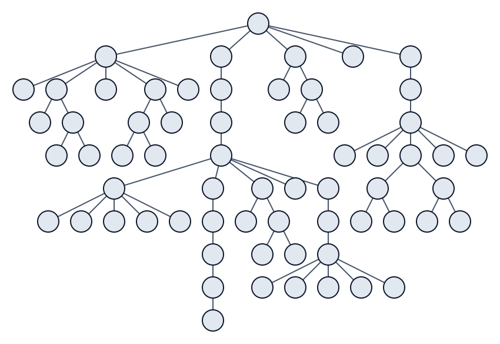

# buchheim

Compute compact layout of a rooted tree in linear time.

Originally described in [Improving Walker's Algorithm to Run in Linear Time](https://doi.org/10.1007/3-540-36151-0_32) paper ([OCR](https://pastebin.com/ixE1gKw4), [explanation](https://llimllib.github.io/pymag-trees/)).

Based on [this](https://github.com/is55555/layoutTree) Python implementation.

[Validated](./src/index.test.ts) with property-based tests to conform to "good layout" rules from the paper (and some more).

Linear time is [validated](./src/bench.test.ts) with benchmarking and statistics.



## Usage

```sh
npm install buchheim
```

```ts
import { layout, normalize, type Tree } from "buchheim";

const tree: Tree<string> = {
    value: "root",
    children: [
        {
            value: "left",
            children: [],
        },
        {
            value: "right",
            children: [],
        },
    ],
};

// with root at 0
const positioned = layout(tree);

// with leftmost node at 0
const normalized = normalize(positioned);
```
