# Examples

## `example01`

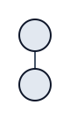

## `example02`

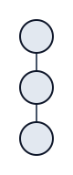

## `example03`

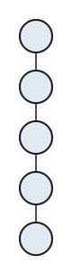

## `example04`

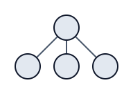

## `example05`

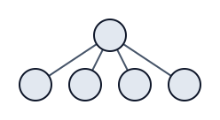

## `example06`

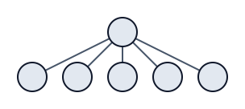

## `example07`

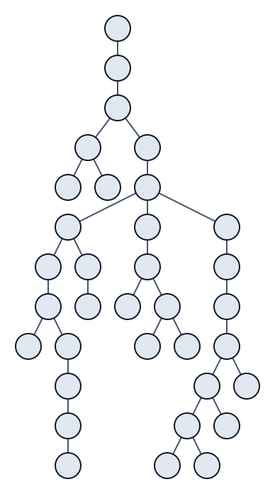

## `example08`

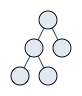

## `example09`

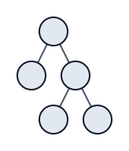

## `example10`

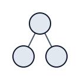

## `example11`

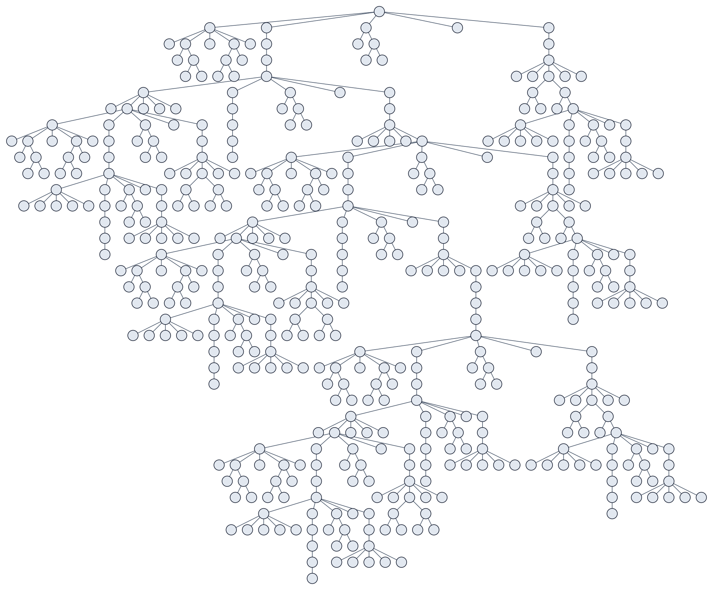

## `example12`

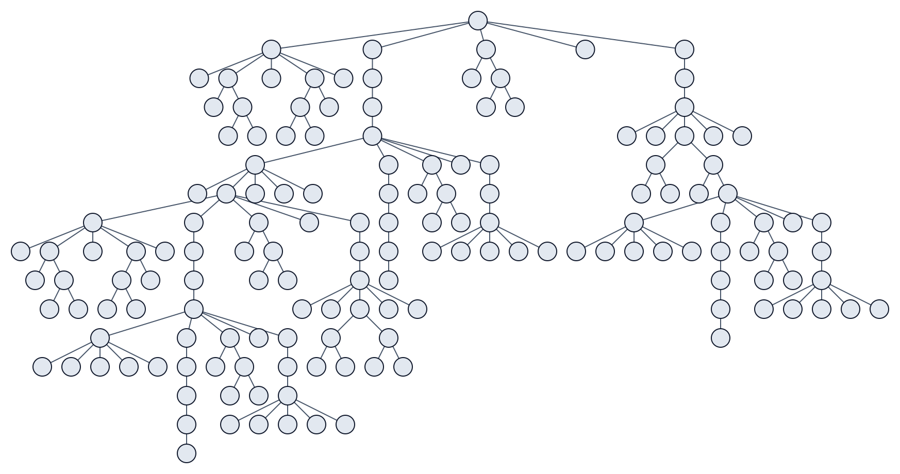

## `example13`

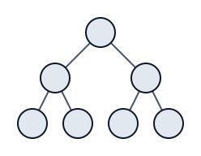

## `example14`

## `example15`

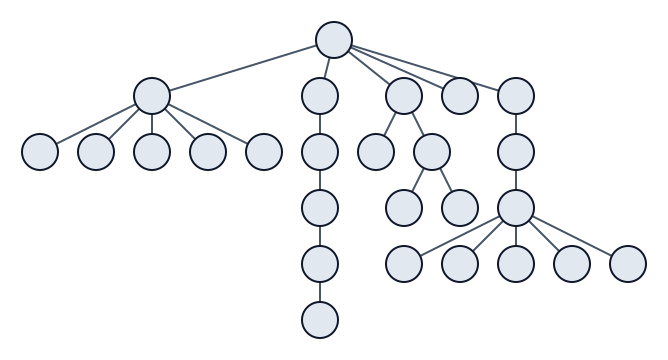
